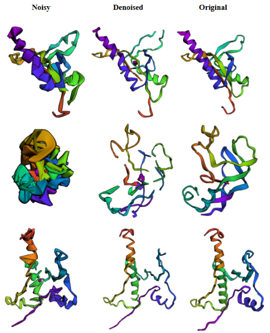
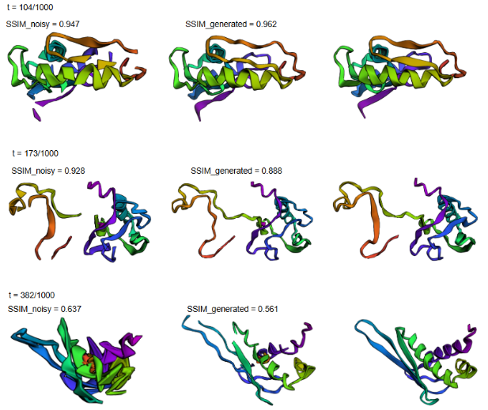

# Protein Backbone Structure Generation using Diffusion Models

This project implements a minimal Denoising Diffusion Probabilistic Model (DDPM) for generating novel protein backbone structures. Inspired by the success of diffusion models in image and signal generation, this work extends their application to biomedical domains, specifically protein structure generation.

---

## 📌 Overview

The goal is to train a UNet-based diffusion model to convert Gaussian noise into meaningful 3D protein backbone structures. Applications include de novo protein design and targeted protein engineering for use in medicine and drug discovery.

---

## 🚀 Approach

1. **Model**: UNet-based noise estimation network conditioned on time-step embeddings.
2. **Training**:
   - Forward process: add Gaussian noise over `T` timesteps.
   - Reverse process: denoise step-by-step to reconstruct structure.
   - Loss: Mean Squared Error (MSE) between true and predicted noise, with masking for padded regions.
3. **Inference**:
   - Start from Gaussian noise and iteratively denoise to generate novel backbone structures.

---

## 🧠 Model Architecture

- **DDPM Framework**:
  - Forward: Adds noise per a defined schedule.
  - Reverse: Denoises step-wise using learned noise predictor.
- **UNet Design**:
  - Minimal: 3 Conv2D layers (encoder), 3 Conv2D layers (decoder), ReLU activations.
  - Time embedding projected to match encoder output and injected at the bottleneck.
  - No ResNet blocks, attention layers, or residual connections (for simplicity).
  
---

## ⚙️ Training Details

- **Max Length**: 128 residues (structures padded/cropped accordingly).
- **Batch Size**: 64 (max that fits GPU).
- **Epochs**: Up to 20 (convergence observed before 20).
- **Learning Rate**: Tuned per model size.
- **Timesteps**: 1000
- **Beta Schedule**: Linear from β_start to β_end.

Training includes periodic logging of sample reconstructions to visualize model learning.

---

## 📊 Evaluation

### Loss Curve
- Training loss (MSE) dropped from ~0.4 to ~0.17 over 20 epochs.

### Visualizations
- Samples of noisy vs. denoised backbones saved during training.
- 

### Structural Similarity Index (SSIM)
- Used to compare real vs. denoised samples (time-step dependent metric).

### Sampling Results
- Sampling from pure noise did not yield meaningful structures.
- Likely due to insufficient training or implementation issues.

---

## 🔍 Limitations & Future Work

**Model Improvements**
- Use deeper networks with attention and residual connections.
- Integrate sequence-based conditioning (e.g., via protein LLMs).
- Explore alternative denoising (e.g., DDIM) and noising (e.g., centroid collapse) strategies.

**Training Enhancements**
- Use schedulers like OneCycleLR.
- Larger batch sizes via gradient accumulation.

**Sampling Reliability**
- Improve training and implementation to enable stable generation from pure noise.

---

## 🧪 Dataset

- Uses CATH protein structure dataset.
- Backbones extracted and preprocessed to fixed-length format.

---

## How to run ? 
### Build image
- docker build -t protein-diffusion .
 
### Run container
- docker run --rm --gpus all --env PYTHONPATH=":/app/src" --volume .:/app -it protein-diffusion

## 🙏 Acknowledgments

Special thanks to the following contributors and resources for their inspiration and support:

- [Lucidrains (Phil Wang)](https://github.com/lucidrains)
- [Umar Jamil](https://github.com/hkproj)
- [Rosetta Commons](https://www.youtube.com/@RosettaCommons)
---

## 📄 References

- Ho et al. (2020) — *Denoising Diffusion Probabilistic Models*
- Ingraham et al. (2023) — *Chroma: Illuminating protein space with a programmable generative model*
- Dauparas et al. (2022) — *ProteinMPNN*
- Song et al. (2021) — *Denoising Diffusion Implicit Models (DDIM)*
